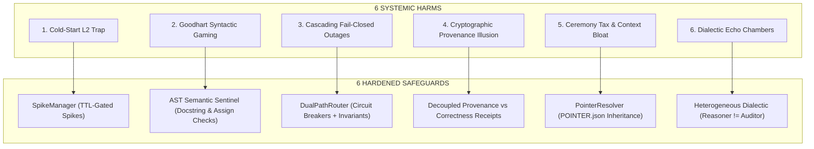

# ⚙️ THE APEX OMNIVERSAL DEVELOPMENT PROCESS SPECIFICATION

```
                           THE OMNIVERSAL LIFECYCLE
                                       
  ┌──────────────┐     ┌──────────────┐     ┌──────────────┐     ┌──────────────┐
  │   STAGE 0    │ ──► │   STAGE 1    │ ──► │   STAGE 2    │ ──► │   STAGE 3    │
  │  Epistemic   │     │ Architecture │     │   Pro-Code   │     │ Adversarial  │
  │  Inception   │     │ & Invariants │     │ Implement    │     │ Verification │
  └──────────────┘     └──────────────┘     └──────────────┘     └──────────────┘
         │                                                              ▲
         ▼                                                              │
  ┌──────────────┐     ┌──────────────┐     ┌──────────────┐            │
  │   STAGE 4    │ ──► │   STAGE 5    │ ──► │   STAGE 6    │ ───────────┘
  │ Distributed  │     │  Telemetry   │     │ Dialectic    │
  │ State & Mesh │     │ Self-Healing │     │ Swarm Review │
  └──────────────┘     └──────────────┘     └──────────────┘
         │
         ▼
  ┌──────────────┐     ┌──────────────┐
  │   STAGE 7    │ ──► │   STAGE 8    │
  │ Dev Fork     │     │ Bodybuilder  │
  │ Evolution    │     │ Release (G9) │
  └──────────────┘     └──────────────┘
```

---

## 🏛️ Executive Overview

The APEX Omniversal Development Process is the immutable engineering standard governing all software, hardware-interfacing, machine learning, and autonomous agent systems across the decentralized Holographic Mesh.

It enforces three foundational tenets:
1. **The Epistemic Law of Action**: No operational code mutation is authorized below $\mathcal{L}_2$ (Behavioral Proof). Enterprise deliverables require $\mathcal{L}_5$ (Dialectic Swarm Consensus).
2. **Fail-Closed Architecture**: Systems must explicitly define refusal paths and structured reason codes. Permissive failure and unhandled exceptions are defects.
3. **Deterministic Provenance**: Code, test assertions, and build artifacts must be cryptographically hashed using SHA-256 and immutably recorded.

---

## 🔄 The 9 Stages of the Development Lifecycle

### STAGE 0: Epistemic Inception & Problem Contracting ($\mathcal{L}_0 \to \mathcal{L}_1$)
Before writing a single line of functional logic or creating a repository:
1. **Mandate Formulation**: Write `ISSUE_CONTRACT.md` specifying:
   - The verified pain point and operational context.
   - Core objectives with measurable empirical metrics.
   - Explicit **Non-Goals** preventing scope creep.
   - Identified failure modes and corresponding refusal codes.
2. **Epistemic Classification (`epicenter`)**:
   - Tag all incoming observations as `(L0)` (Presence only).
   - Tag all schema/type signatures as `(L1)` (Structure only).
   - Reject any claim that treats existence on disk as functional behavior.
3. **Gate 0 Verification**:
   - Contract exists, is reviewed, and is committed as the first artifact.

---

### STAGE 1: Architectural Blueprint & Formal Invariant Design (Phase 2 Study)
1. **Architecture Decision Record (ADR)**:
   - Codify the architecture in `ARCHITECTURE.md`.
   - Document state machines, concurrency models, and memory layouts.
2. **Fail-Closed State Boundaries**:
   - Define exact Enum of refusal reason codes (e.g., `ERR_INVALID_INPUT`, `ERR_BUFFER_OVERFLOW`, `ERR_TIMEOUT`).
   - Specify deterministic default safe states upon receipt of malformed input.
3. **AST Invariant Modeling**:
   - Specify interface contracts and type definitions with zero `any` or untyped signatures.
   - Ensure boundary isolation between Technology (tools/engines) and Data (state/evidence).

---

### STAGE 2: Pro-Code Implementation (Phase 3 Act & Helix Alpha/Omega)
1. **Double Helix Alpha/Omega Principles**:
   - **One Big Push**: Implement related files and tests in a single coherent, atomic commit.
   - **Zero-Stub Mandate**: Strict prohibition of `pass`, `return True`, `return None` mocks, or `TODO` placeholders in shipped code. Every function must execute complete domain logic.
   - **Zero Magic Numbers**: All constants, timeouts, buffer sizes, and thresholds must be declared as named constants or configurable parameters with safe defaults.
2. **Polyglot Fluency**:
   - Select the optimal language for the category based on the Babel Matrix (`BABEL.md`).
   - Enforce strict typing, zero compiler warnings, and memory safety.

---

### STAGE 3: Verification, Adversarial Hardening & Epistemic Proof ($\mathcal{L}_2$)
1. **Test-Driven Red-Green Cycles**:
   - Write behavioral tests asserting both expected outcomes and boundary conditions.
2. **Adversarial & Refusal Path Coverage**:
   - Gate G2 requires:
     $$\text{Total Test Methods} \ge 8 \quad\land\quad \text{Adversarial/Refusal Tests} \ge 4$$
   - Tests must intentionally provide malformed payloads, zero-byte inputs, concurrency races, and resource starvation, asserting that the system refuses cleanly with the documented reason code.
3. **Cryptographic Provenance Manifest**:
   - Execute `apex-process receipt .` to compute SHA-256 digests of all source files and generate `EVIDENCE_RECEIPT.json`.
4. **Iron Law of Verification Before Completion**:
   - Completion claims are strictly forbidden without fresh, green test execution output executed in the current turn.

---

### STAGE 4: Distributed State, Mesh & Backend Integration ($\mathcal{L}_3$)
1. **RPC & Protocol Buffers**:
   - Define zero-copy schemas (Cap'n Proto, FlatBuffers, or gRPC Protobufs).
2. **Transactional Integrity**:
   - Database mutations must be ACID-compliant with rollback mechanisms or idempotent CRDT state sync.
3. **Multi-Cloud Synchronization**:
   - Ensure assets and state integrate with decentralized object storage lakes via encrypted Rclone streams.

---

### STAGE 5: Telemetry, Observability & Closed-Loop Self-Healing ($\mathcal{L}_4$)
1. **Bounded Latency Budgets**:
   - Measure and enforce Time-To-First-Token (TTFT) and processing latency budgets.
2. **Memory Profiling**:
   - Profile heap allocations; verify zero memory leaks under sustained throughput.
3. **Automated Traceback AST Repair**:
   - Integrate with `apex-repair` to parse tracebacks at the AST level and self-heal transient logic errors without developer intervention.

---

### STAGE 6: Multi-Agent Dialectic Swarm Review ($\mathcal{L}_5$)
1. **4-Phase Consensus Engine**:
   - **Phase 1 (Reasoner / R1)**: Structural invariant and formal edge-case audit.
   - **Phase 2 (Synthesizer / Qwen Coder)**: Implementation refinement and AST hardening.
   - **Phase 3 (Auditor / DeepSeek V3)**: Adversarial security and vulnerability penetration scan.
   - **Phase 4 (Perception / MiMo / Gemini)**: Multi-modal and cross-vault context verification.
2. **Consensus Receipt**:
   - All 4 agents issue signed verification receipts before enterprise release is authorized.

---

### STAGE 7: Dev Fork Doctrine & Continuous Parity Governance ($\mathcal{L}_6$)
1. **Pristine Upstream Tracking**:
   - Upstream base branches must never be modified destructively.
2. **Decoupled Overlay Pattern**:
   - Custom features live in `extensions/`, `plugins/`, or `sidecars/`.
3. **Automated Upstream Sync**:
   - Scheduled CI pipelines rebase upstream deltas, run full regression suites, and flag behavioral drift.
4. **Synaptic Memory Reinforcement**:
   - Register repository entities in the 291k-entity Hebbian knowledge graph.

---

### STAGE 8: The Bodybuilder Production Standard (Gates G0–G9)
A repository achieves official **Bodybuilder Status** only when passing all 10 Gates:

| Gate | Name | Requirement & Proof |
|:---:|:---|:---|
| **G0** | **Issue Contract** | Valid `ISSUE_CONTRACT.md` with pain point, non-goals, and failure modes. |
| **G1** | **Fail-Closed Architecture** | Documented refusal reason codes and fail-safe defaults in core engine. |
| **G2** | **Adversarial Test Suite** | $\ge 8$ total tests, $\ge 4$ adversarial/refusal tests, 100% pass rate. |
| **G3** | **Cryptographic Receipt** | `EVIDENCE_RECEIPT.json` with deterministic SHA-256 hashes. |
| **G4** | **License Integrity** | GlacierEQ Proprietary v1.1 or verified open-source license. |
| **G5** | **Quality Honesty** | `QUALITY.md` explicitly contrasting verified invariants vs open frontiers. |
| **G6** | **Production CI Workflow** | `.github/workflows/ci.yml` running lint, tests, and gate audits. |
| **G7** | **Babel Polyglot Spec** | `BABEL.md` justifying language choices and translation bridges. |
| **G8** | **Zero Stubs Invariant** | AST sentinel verifies zero `pass`, `return True`, or placeholder stubs. |
| **G9** | **Executive Presentation** | Professional `README.md` following the 4-part presentation funnel. |

---

## 🛡️ The 6 Hardened Safeguards & Anti-Harm Architecture

The APEX Omniversal Development Process rigorously eliminates the six systemic failure modes that arise when epistemic rigor is practiced dogmatically:



### 1. Zero-to-One Sandbox Spikes (`SpikeManager` & `L0_SPIKE`)
- **Failure Mode Solved**: *The Cold-Start $\mathcal{L}_2$ Trap*. Requiring full $\mathcal{L}_2$ behavioral proofs before an algorithm or API shape is even understood paralyzes creative exploration.
- **Safeguard Architecture**:
  - Developers initialize isolated prototyping spikes via `apex-process spike init <name>`.
  - Spikes live under `spikes/<name>/` with a strict Time-To-Live (default: 72 hours).
  - Spikes are strictly classified as $\mathcal{L}_{0\text{-SPIKE}}$ and are exempt from production gate audits (G0–G9) and zero-stub sentinels.
  - Spikes can **never** be imported by production packages (`src/`) or merged directly to `main`.
  - Graduation to production requires `apex-process spike graduate <name>`, which enforces full $\mathcal{L}_2$ compliance (100% green tests, 0 stubs, Issue Contract).

### 2. AST Semantic Anti-Gaming Sentinel (`ASTStubSentinel`)
- **Failure Mode Solved**: *Goodhart's Law & Syntactic Gaming*. Banning `pass` or `return True` causes agents to generate trivial mocks (e.g., empty docstrings, `x = True; return x`, or non-functional structural shells) that pass naive syntactic checks while remaining non-functional.
- **Safeguard Architecture**:
  - The AST Sentinel deeply inspects function bodies for semantic vacuity:
    - Rejects functions containing only docstrings or string expressions (`DOCSTRING_ONLY_STUB`).
    - Rejects two-statement mock returns (`ASSIGN_RETURN_TRIVIAL_STUB`).
    - Excludes legitimate abstract methods (`@abstractmethod`) while scanning polyglot implementations (Rust `todo!()`/`unimplemented!()`, Go `panic("todo")`, Python `raise NotImplementedError`).
    - Scans are strictly targeted at production code, cleanly ignoring `spikes/` and `scratch/`.

### 3. Dual-Path Resilience & Circuit Breakers (`DualPathRouter`)
- **Failure Mode Solved**: *Cascading Fail-Closed Outages*. Unconditional fail-closed refusal in non-critical operational paths turns single-component transient glitches into catastrophic total-system outages.
- **Safeguard Architecture**:
  - Enforces ontological separation between two fault classes:
    1. `CRITICAL_INVARIANT`: Data corruption, cryptographic verification, Bates stamping, financial transactions, legal evidence. **Hard refusal mandatory** (`ERR_INVARIANT_HARD_REFUSAL`). Zero fallbacks permitted.
    2. `OPERATIONAL_WORKFLOW`: UI rendering, search indexing, recommendations, cache warming. **Graceful degradation authorized** with Dead-Letter Queue (DLQ) routing.
  - Implements stateful `CircuitBreaker` (CLOSED $\to$ OPEN $\to$ HALF_OPEN) with sliding failure windows and auto-recovery reset timeouts to halt cascading refusal storms.

### 4. Decoupling Provenance from Correctness
- **Failure Mode Solved**: *The Cryptographic Provenance Illusion*. SHA-256 digests prove bit-for-bit absence of tampering; they do **not** prove that the underlying logic is mathematically correct or legally sound. Confusing the two creates false epistemic security.
- **Safeguard Architecture**:
  - `generate_verification_record` explicitly splits audit receipts into two distinct domains:
    1. `sha256_provenance_digest`: Proves immutable artifact identity and tamper-evident lineage.
    2. `behavioral_proof`: Captures live execution exit codes, assertion counts, and test results.
  - Every verification record includes an explicit statutory disclaimer: *SHA-256 provenance proves tamper-absence; operational correctness requires green behavioral proofs.*

### 5. Token-Saver Pointer Architecture (`PointerResolver`)
- **Failure Mode Solved**: *Ceremony Tax & Context Window Bloat*. Requiring 10 heavy documentation and governance files (`LICENSE`, `BABEL.md`, `PROCESS.md`, `ARCHITECTURE.md`) in every micro-package exhausts LLM context windows and developer cognitive load with 80% redundant boilerplate.
- **Safeguard Architecture**:
  - Leaf repositories and modules declare a lightweight `POINTER.json` referencing a shared central governance root.
  - The Gate Auditor resolves inherited artifacts (`inherited_gates: ["G4", "G7"]`) through `PointerResolver`, satisfying gates without duplicating 20KB markdown files.
  - Pointers record canonical URI, commit hash, and inherited gate contracts, preserving 100% auditability while saving thousands of context tokens.

### 6. Heterogeneous Swarm Dialectic Diversity
- **Failure Mode Solved**: *Synthetic Dialectic Echo Chambers*. When the same LLM architecture serves as Reasoner, Synthesizer, and Auditor, it suffers from correlated hallucinations, blind spots, and synthetic complacency, rubber-stamping defective designs.
- **Safeguard Architecture**:
  - The Swarm Dialectic Engine enforces model diversity:
    - Rejects consensus if Reasoner and Auditor share the same model family (`ERR_SWARM_HOMOGENEOUS_AUDITOR`).
    - Requires distinct cognitive weights (e.g., DeepSeek R1 for formal reasoning, Qwen 2.5 Coder for synthesis, DeepSeek V3 for adversarial auditing).
    - Requires empirical compiler/test proof receipts (`ERR_SWARM_MISSING_COMPILER_PROOF`); rhetoric without compiler verification cannot achieve consensus.

