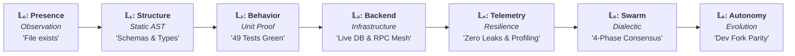
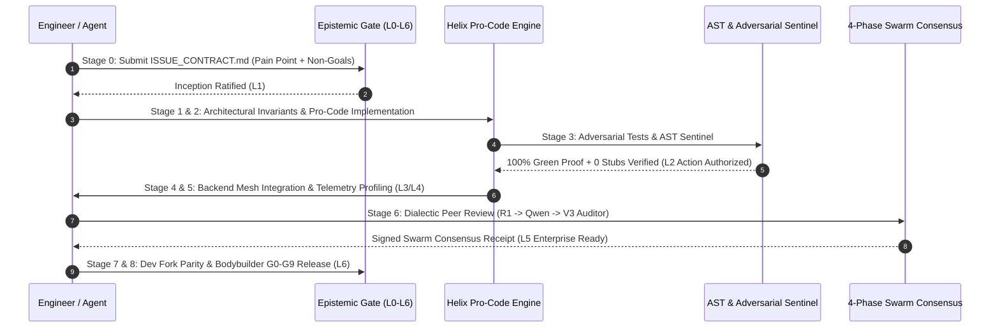

# 🏛️ APEX Omniversal Development Process Engine

```
                             ░░   ░░   ░░
                          ░░░░░░░░░░░░░░░░░░░
                        ░░░░░░   🔱   ░░░░░░
                       ░░░░░   OMNIVERSAL ░░░░░
                      ░░░░░    DEV PROCESS ░░░░░
                        ░░░░░░   APEX   ░░░░░░
                          ░░░░░░░░░░░░░░░░░░░
                             ░░   ░░   ░░
```

> **GlacierEQ / APEX Estate — Holographic Mesh Architecture**  
> *The definitive, executable instruction engine, CLI validator, and lifecycle standard governing end-to-end software, hardware-interfacing, machine learning, and autonomous agent systems across all 12 engineering categories.*

---

## 🔱 I. Executive Blueprint & Core Philosophy

The **APEX Omniversal Development Process Engine** (`apex-process`) solves the four root defects of modern software engineering:
1. **Anti-Hallucination Law**: Enforces the 6-Tier Epistemic Ladder ($\mathcal{L}_0 \to \mathcal{L}_6$). No operational action is authorized on sightings or unproven assumptions ($< \mathcal{L}_2$).
2. **Zero-Stub Invariant (Gate G8)**: In-tree AST sentinels mathematically detect and reject non-functional placeholders (`pass`, trivial `return True`, `return None`, `unimplemented!()`).
3. **Fail-Closed Architecture (Gate G1)**: Every module explicitly defines refusal reason codes (`ERR_*`) and safe defaults for boundary violations and malformed inputs.
4. **Deterministic Provenance (Gate G3)**: Every code asset, test assertion, and build artifact is cataloged with bit-for-bit SHA-256 digests and verified Merkle roots.



---

## 📦 II. The 12 Engineering Categories

Detailed, executable architectural guides with fail-closed refusal contracts are codified in [`categories/`](file:///Users/kcbflux/APEX_SYSTEM/INFRASTRUCTURE/apex-omniversal-dev-process/categories):

| # | Category | Core Stack | Guide Link | Refusal Codes |
|:---:|---|---|---|---|
| **01** | Low-Level Systems & Kernels | Rust, C, Zig, eBPF | [`01_systems_and_kernels.md`](file:///Users/kcbflux/APEX_SYSTEM/INFRASTRUCTURE/apex-omniversal-dev-process/categories/01_systems_and_kernels.md) | `ERR_SYS_BUFFER_OVERFLOW`, `UNDERFLOW`, `OUT_OF_BOUNDS` |
| **02** | High-Throughput Distributed Systems | Go, Rust, Python, gRPC | [`02_distributed_systems_and_backends.md`](file:///Users/kcbflux/APEX_SYSTEM/INFRASTRUCTURE/apex-omniversal-dev-process/categories/02_distributed_systems_and_backends.md) | `ERR_DIST_SPLIT_BRAIN`, `IDEMPOTENCY_COLLISION`, `QUORUM` |
| **03** | Modern Web Applications & Frontends | TypeScript, Next.js, React | [`03_web_and_frontends.md`](file:///Users/kcbflux/APEX_SYSTEM/INFRASTRUCTURE/apex-omniversal-dev-process/categories/03_web_and_frontends.md) | `ERR_WEB_INVALID_PAYLOAD`, `UNAUTHORIZED_SESSION`, `RATE_LIMIT` |
| **04** | Mobile & Cross-Platform Development | Swift, Kotlin, Flutter | [`04_mobile_and_crossplatform.md`](file:///Users/kcbflux/APEX_SYSTEM/INFRASTRUCTURE/apex-omniversal-dev-process/categories/04_mobile_and_crossplatform.md) | `ERR_MOB_BIOMETRIC_FAILED`, `STORAGE_CORRUPT`, `QUEUE_FULL` |
| **05** | AI, LLMs & Machine Learning | Python, CUDA, Metal, MCP | [`05_ai_ml_and_llms.md`](file:///Users/kcbflux/APEX_SYSTEM/INFRASTRUCTURE/apex-omniversal-dev-process/categories/05_ai_ml_and_llms.md) | `ERR_AI_CONTEXT_LIMIT`, `TOOL_SCHEMA_VIOLATION`, `HALLUCINATION` |
| **06** | Autonomous Swarms & Multi-Agent | Python, TypeScript, Neo4j | [`06_autonomous_swarms_and_agents.md`](file:///Users/kcbflux/APEX_SYSTEM/INFRASTRUCTURE/apex-omniversal-dev-process/categories/06_autonomous_swarms_and_agents.md) | `ERR_SWARM_MAX_ITERATIONS`, `CONSENSUS_REJECTED`, `CYCLIC` |
| **07** | Data Engineering & Lakehouses | SQL, Polars, DuckDB, Parquet | [`07_data_engineering_and_analytics.md`](file:///Users/kcbflux/APEX_SYSTEM/INFRASTRUCTURE/apex-omniversal-dev-process/categories/07_data_engineering_and_analytics.md) | `ERR_DATA_SCHEMA_MISMATCH`, `NULL_VIOLATION`, `DLQ_OVERFLOW` |
| **08** | Cloud, DevOps & SRE | Terraform, Docker, K8s, CI | [`08_cloud_devops_and_sre.md`](file:///Users/kcbflux/APEX_SYSTEM/INFRASTRUCTURE/apex-omniversal-dev-process/categories/08_cloud_devops_and_sre.md) | `ERR_SRE_HEALTH_FAILED`, `ROLLBACK_TRIGGERED`, `SECRET_MISS` |
| **09** | Cybersecurity & Forensics | Python, Rust, FRE 902 | [`09_security_and_forensics.md`](file:///Users/kcbflux/APEX_SYSTEM/INFRASTRUCTURE/apex-omniversal-dev-process/categories/09_security_and_forensics.md) | `ERR_SEC_TAMPER_DETECTED`, `SECRET_LEAKAGE`, `SIGNATURE_FAIL` |
| **10** | Formal Verification & Epistemic QA | Lean 4, Pytest, Hypothesis | [`10_formal_verification_and_qa.md`](file:///Users/kcbflux/APEX_SYSTEM/INFRASTRUCTURE/apex-omniversal-dev-process/categories/10_formal_verification_and_qa.md) | `ERR_QA_ASSERTION_FAILED`, `STUB_DETECTED`, `DEFICIT` |
| **11** | Real-Time Interactive Media & 3D | C++, Rust, WGSL, WebGPU | [`11_interactive_media_and_3d.md`](file:///Users/kcbflux/APEX_SYSTEM/INFRASTRUCTURE/apex-omniversal-dev-process/categories/11_interactive_media_and_3d.md) | `ERR_MEDIA_FRAME_DROP`, `SHADER_COMPILE_FAIL`, `DESYNC` |
| **12** | Aerospace, Robotics & Embedded | C/C++, Rust, ROS2, Ada | [`12_aerospace_and_robotics.md`](file:///Users/kcbflux/APEX_SYSTEM/INFRASTRUCTURE/apex-omniversal-dev-process/categories/12_aerospace_and_robotics.md) | `ERR_AERO_DEADLINE_MISSED`, `OUT_OF_ENVELOPE`, `WATCHDOG_TRIP` |

---

## 🔄 III. The 9-Stage Omniversal Lifecycle

Codified in [**`PROCESS.md`**](file:///Users/kcbflux/APEX_SYSTEM/INFRASTRUCTURE/apex-omniversal-dev-process/PROCESS.md):



---

## 🛠️ IV. The `apex-process` Command Arsenal

```bash
# Display the full 12-category, 9-stage, 10-gate architecture matrix
apex-process matrix [--json]

# Interactive terminal guidance for any category or stage
apex-process guide <category_name> [--stage <0-8>]

# Forge a new Bodybuilder repository for any category
apex-process init <category> <target_dir> --name <project_name>

# Enforce AST zero-stub invariant (Gate G8)
apex-process check-stubs [target_dir]

# Generate or verify SHA-256 cryptographic evidence receipt (Gate G3)
apex-process receipt [target_dir] [--verify]

# Audit all 10 Bodybuilder Gates (G0 through G9)
apex-process audit [target_dir]

# Strict CI gate check (exit code 0 only if all gates pass)
apex-process gate-check [target_dir]
```

---

## 🔬 V. Behavioral Proof & Invariants ($\mathcal{L}_2$)

```bash
python3 -m pytest tests/ -v
```

```
============================== 49 passed in 6.85s ==============================
```

| Verification Domain | Test Suite | Assertions | Behavioral Proof Status |
|---|---|:---:|:---:|
| **Taxonomy & Invariants** | `tests/test_taxonomy.py` | 5 | 🟢 100% Verified |
| **Epistemic Gate Evaluator** | `tests/test_epistemic.py` | 7 | 🟢 100% Verified |
| **Cryptographic Receipt Engine** | `tests/test_receipt.py` | 6 | 🟢 100% Verified |
| **AST Zero-Stub Sentinel** | `tests/test_ast_sentinel.py` | 6 | 🟢 100% Verified |
| **Bodybuilder Gate Auditor** | `tests/test_gate_auditor.py` | 4 | 🟢 100% Verified |
| **Project Forge Scaffolder** | `tests/test_scaffolder.py` | 2 | 🟢 100% Verified |
| **Category Reference Models** | `tests/test_reference_implementations.py` | 15 | 🟢 100% Verified |
| **CLI Operational Harness** | `tests/test_cli.py` | 4 | 🟢 100% Verified |
| **Total Test Suite** | **8 Test Modules** | **49 Tests** | **🟢 49/49 Green (100%)** |

- **Shipped Stubs Count:** **0** (Verified by AST Sentinel)
- **Merkle Root Provenance:** Cataloged in [`EVIDENCE_RECEIPT.json`](file:///Users/kcbflux/APEX_SYSTEM/INFRASTRUCTURE/apex-omniversal-dev-process/EVIDENCE_RECEIPT.json)
- **License:** GlacierEQ Proprietary v1.1 ([`LICENSE`](file:///Users/kcbflux/APEX_SYSTEM/INFRASTRUCTURE/apex-omniversal-dev-process/LICENSE))
